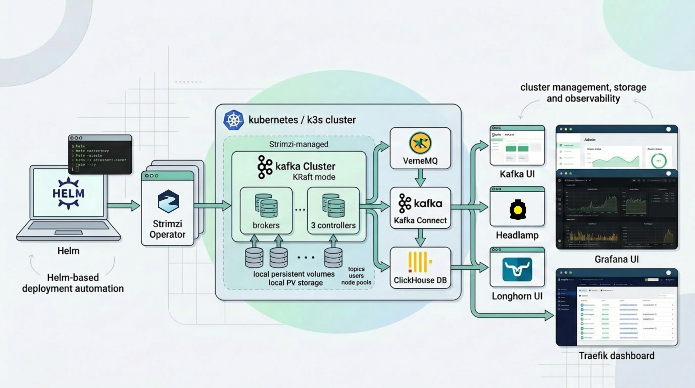

# kafka-cluster

[https://github.com/pvamos/kafka-cluster](https://github.com/pvamos/kafka-cluster)

Helm-based deployment project for an environmental monitoring data platform on Kubernetes.

The repository uses **Longhorn storage** using worker node disks, a **Strimzi-managed Kafka cluster**, **VerneMQ MQTT broker** including custom Erlang plugin, **Kafka Connect** including custom Java SMT (single message transform), **ClickHouse DB**, **ClickHouse backup jobs**, **Grafana**, and UI ingress helpers for **Kafka UI**, **Longhorn UI**, **Headlamp**, and the **k3s Traefik dashboard**.



The stack is designed for an existing Kubernetes/k3s cluster where:

* Kafka brokers and controllers use local PersistentVolumes.
* Strimzi manages Kafka in **KRaft mode**.
* VerneMQ receives MQTT sensor messages and enriches them with custom plugin written in Erlang.
* Kafka Connect moves enriched MQTT/protobuf data into Kafka and optionally into S3-compatible object storage with custom SMT (single message transform) written in Java.
* ClickHouse ingests Kafka messages through a Kafka Engine table and materialized view.
* Grafana visualizes environmental sensor measurements from ClickHouse.
* Sensor data is available for custom SQL queries in ClickHouse DB.

> **Public repository note:** the private version of this repository contains real deployment values such as domains, ingress hostnames, image registry names, registry robot tokens, S3 access keys, MQTT usernames/passwords, UI passwords, ClickHouse/Grafana passwords, bucket names, topic names, site/device identifiers, and IP allowlists.
> Public files contain placeholders only.
> Before using the repository, replace placeholders with real values either by editing a private clone directly or by keeping public files unchanged and supplying private value files and environment variables.
> See [Sensitive configuration and public-release checklist](#-sensitive-configuration-and-public-release-checklist) and [Replace placeholders before use](#-replace-placeholders-before-use).

---

## 👨‍🔬 Author

**Péter Vámos**

* [https://github.com/pvamos](https://github.com/pvamos)
* [https://linkedin.com/in/pvamos](https://linkedin.com/in/pvamos)
* [pvamos@gmail.com](mailto:pvamos@gmail.com)

---

## 🎓 Academic context

This project is part of the infrastructure work supporting the author's **2026 thesis project**
for the **Expert in Applied Environmental Studies BSc** program at **John Wesley Theological College, Budapest**.

The platform supports an environmental monitoring system built around ESP32 sensor nodes, MQTT, Kafka, S3-compatible object storage, ClickHouse, and Grafana.

---

## 📜 Overview

The main automation entrypoints are:

```bash
install.sh
uninstall.sh
```

The project is composed of multiple local Helm charts:

* ✅ `vernemq` — VerneMQ MQTT cluster with internal and external listeners and an enrichment plugin
* ✅ `kafka-local-storage` — local PersistentVolumes and StorageClass for Kafka
* ✅ `kafka` — Strimzi Kafka cluster in KRaft mode
* ✅ `kafka-ui` — web UI for Kafka topics, users and consumer groups
* ✅ `longhorn-ui` — Traefik ingress and basic-auth wrapper for Longhorn UI
* ✅ `headlamp` — Kubernetes Headlamp dashboard wrapper chart
* ✅ `traefik-dashboard` — protected ingress route for the k3s bundled Traefik dashboard
* ✅ `kafka-connect` — Strimzi KafkaConnect cluster plus MQTT source and S3 sink connectors
* ✅ `clickhouse` — Altinity ClickHouseInstallation, Keeper, Kafka Engine ingest and schema bootstrap job
* ✅ `clickhouse-backup` — scheduled ClickHouse backups and retention cleanup using S3-compatible storage
* ✅ `grafana` — Grafana with ClickHouse datasource and an imported environmental dashboard

---

## 🧭 What the project does now

The current repository state deploys an end-to-end sensor data platform.

### MQTT ingestion

* Deploys a **3-replica VerneMQ** cluster.
* Schedules VerneMQ on control-plane nodes by default.
* Exposes:
  * an internal ClusterIP MQTT listener on port `1883`
  * an external NodePort listener on port `31883`
* Supports PROXY protocol v2 on the external listener.
* Uses a shared RWX auth file and a bootstrap Job to create MQTT users and ACLs.
* Enriches accepted MQTT protobuf messages and republishes them to enriched MQTT topics.

### Kafka platform

* Deploys Kafka local PersistentVolumes through `kafka-local-storage`.
* Installs the Strimzi Kafka Operator using a pinned chart version from `kafka/values.yaml`.
* Deploys Kafka in **KRaft mode**, without ZooKeeper.
* Uses separate KafkaNodePools for brokers and controllers.
* Uses SCRAM-SHA-512 users managed by Strimzi.
* Creates the sensor topic used by the pipeline.
* Deploys Kafka UI with:
  * backend Kafka SCRAM authentication
  * optional UI login form
  * Traefik ingress

### Kafka Connect

* Deploys a Strimzi `KafkaConnect` resource.
* Uses a custom Kafka Connect image containing required connectors and SMTs.
* Reads enriched MQTT messages from VerneMQ through a Stream Reactor MQTT source connector.
* Writes binary protobuf payloads to Kafka.
* Includes an S3 sink connector configuration for CSV/GZip output into S3-compatible storage.

### ClickHouse

* Installs the Altinity ClickHouse Operator.
* Creates ClickHouse secrets for:
  * ClickHouse authentication
  * Kafka authentication
  * inter-cluster communication
  * S3 backup and data-lake access
* Deploys ClickHouse Keeper and an Altinity `ClickHouseInstallation`.
* Copies protobuf schema files into ClickHouse format schema paths.
* Creates the database, MergeTree table, Kafka Engine table and materialized view through a Helm hook Job.
* Uses Kafka Engine ingestion from the Kafka sensor topic.

### Backups and dashboards

* Deploys ClickHouse backup CronJobs:
  * daily full backup
  * hourly incremental backup
  * cleanup/retention job
* Deploys Grafana with:
  * persistent storage
  * ClickHouse datasource provisioning
  * dashboard import job
  * Traefik ingress
* Deploys optional access helpers for:
  * Longhorn UI
  * Headlamp
  * Traefik dashboard

---

## 📁 Project directory structure

```text
kafka-cluster/
|
├── install.sh                         # End-to-end installer
├── uninstall.sh                       # Uninstall / cleanup helper
├── kafka-local-storage/               # Local PVs and StorageClass for Kafka
│   ├── templates/
│   │   ├── pv.yaml
│   │   └── storageclass.yaml
│   ├── Chart.yaml
│   └── values.yaml
|
├── kafka/                             # Strimzi Kafka cluster chart
│   ├── templates/
│   │   ├── kafka-cluster.yaml
│   │   ├── kafka-nodepools.yaml
│   │   ├── kafka-topics.yaml
│   │   └── kafka-users.yaml
│   ├── operator-values.yaml
│   ├── Chart.yaml
│   └── values.yaml
|
├── kafka-ui/                          # Kafka UI chart
│   ├── templates/
│   │   ├── ingress.yaml
│   │   └── kafka-ui-deployment.yaml
│   ├── Chart.yaml
│   └── values.yaml
|
├── kafka-connect/                     # Strimzi KafkaConnect and connector CRs
│   ├── templates/
│   │   ├── kafka-connect.yaml
│   │   ├── mqtt-connector.yaml
│   │   └── s3-connector.yaml
│   ├── Chart.yaml
│   └── values.yaml
|
├── vernemq/                           # VerneMQ MQTT broker chart
│   ├── templates/
│   │   ├── statefulset.yaml
│   │   ├── service-*.yaml
│   │   ├── auth-bootstrap-job.yaml
│   │   └── auth-pvc.yaml
│   ├── values.schema.json
│   ├── Chart.yaml
│   └── values.yaml
|
├── clickhouse/                        # ClickHouse Keeper + CHI + schema init job
│   ├── templates/
│   │   ├── chi.yaml
│   │   ├── keeper.yaml
│   │   ├── init-job.yaml
│   │   └── proto-configmap.yaml
│   ├── Chart.yaml
│   └── values.yaml
|
├── clickhouse-backup/                 # ClickHouse backup CronJobs
│   ├── templates/
│   │   ├── cronjob-daily.yaml
│   │   ├── cronjob-hourly.yaml
│   │   └── cronjob-cleanup.yaml
│   ├── Chart.yaml
│   └── values.yaml
|
├── grafana/                           # Grafana, ClickHouse datasource and dashboard import
│   ├── dashboards/
│   │   └── envsensor.net.json
│   ├── templates/
│   │   ├── deployment.yaml
│   │   ├── ingress.yaml
│   │   ├── configmap-datasources.yaml
│   │   └── job-set-home-dashboard.yaml
│   ├── Chart.yaml
│   └── values.yaml
|
├── longhorn-ui/                       # Longhorn UI ingress and basic auth
├── traefik-dashboard/                 # k3s Traefik dashboard ingress route
├── headlamp/                          # Headlamp wrapper chart
├── LICENSE
└── README.md
```

---

## ⚙️ Prerequisites

### Kubernetes cluster

This project assumes an existing Kubernetes/k3s cluster with:

* working `kubectl` access from the machine running `install.sh`
* Helm 3
* nodes labelled for scheduling:
  * Kafka broker nodes: `node-role.kubernetes.io/kafka=true`
  * worker nodes: `node-role.kubernetes.io/worker=true`
  * control-plane nodes: `node-role.kubernetes.io/control-plane=true`
* local storage paths present on Kafka nodes, by default `/var/lib/kafka`
* Longhorn installed if charts use Longhorn-backed PVCs
* k3s Traefik available if ingress resources use the `traefik` ingress class
* DNS records pointing to the external ingress or HAProxy endpoint

### Control machine tools

The install script expects:

```bash
kubectl
helm
yq
openssl
```

Example installation on a Linux workstation depends on your distribution. Verify tools before running:

```bash
kubectl version --client
helm version
yq --version
openssl version
```

---

## 🧱 Component details

### `vernemq`

The VerneMQ chart deploys a StatefulSet with:

* 3 replicas by default
* internal MQTT listener on `1883`
* external NodePort listener on `31883`
* optional PROXY protocol support
* shared RWX authentication PVC
* bootstrap Job for password and ACL files
* MQTT-to-MQTT enrichment rules

Sensitive values are mainly in `authFile.bootstrap.users`, `authFile.aclContent`, image repository names and image pull secrets.

### `kafka-local-storage`

The Kafka local storage chart creates:

* `kafka-local` StorageClass
* local PersistentVolumes for broker nodes
* local PersistentVolumes for controller nodes

The current values assume named nodes such as `worker1` and `control1`, and local storage at `/var/lib/kafka`.

### `kafka`

The Kafka chart creates:

* Strimzi `Kafka` resource
* KafkaNodePools for brokers and controllers
* SCRAM users
* Kafka topics

The current values use:

* Kafka version `4.1.1`
* Strimzi operator chart version `0.49.1`
* broker replicas: `5`
* controller replicas: `3`
* SCRAM-SHA-512 authentication on the internal listener
* KRaft mode

### `kafka-ui`

Kafka UI connects to Kafka through Strimzi-generated SCRAM credentials and can expose a separate web login form.

Sensitive values:

* UI login password
* ingress hostname
* cluster display name if it reveals site/location

### `kafka-connect`

The Kafka Connect chart creates:

* Strimzi `KafkaConnect`
* MQTT source connector
* S3 sink connector

Sensitive values:

* custom image registry
* image pull secret
* MQTT password
* MQTT topics that reveal site/device names
* S3 access keys, bucket names and endpoint
* connector names and client IDs if they reveal private deployment naming

### `clickhouse`

The ClickHouse chart deploys:

* Altinity `ClickHouseInstallation`
* Keeper
* protobuf schema ConfigMap
* schema/init Job
* Kafka Engine ingestion table
* materialized view into a replicated MergeTree table
* S3 named collections through Kubernetes Secrets

Sensitive values are mainly created by `install.sh`: ClickHouse password and S3 credentials.

### `clickhouse-backup`

The backup chart deploys CronJobs for:

* daily full backups
* hourly incremental backups
* backup cleanup/retention

Sensitive values include bucket names, endpoint, region and any credential references.

### `grafana`

The Grafana chart deploys:

* Grafana server
* persistent PVC
* ClickHouse datasource provisioning
* dashboard import Job
* ingress

Sensitive values:

* Grafana admin password
* ingress hostname
* dashboard title/domain if deployment-specific
* ClickHouse datasource credentials, which are read from Kubernetes Secrets

### `longhorn-ui`, `traefik-dashboard`, `headlamp`

These charts expose cluster UIs through Traefik.

Sensitive values:

* public hostnames
* basic-auth hashes
* IP allowlists
* service-account/token access procedures

---

## ⚠️ Operational cautions

This project performs invasive operations on a Kubernetes cluster:

* creates and modifies namespaces
* creates image pull secrets and application secrets
* deploys stateful workloads
* creates local PersistentVolumes
* installs and upgrades the Strimzi operator
* deploys Kafka, VerneMQ, ClickHouse, Grafana and dashboard ingresses
* creates Kafka users and topics
* creates Kafka Connect connectors
* creates ClickHouse databases, Kafka Engine tables and materialized views
* creates backup CronJobs and S3 credential secrets

Review all values and namespaces carefully before running it against a real cluster.

---

## 🧭 Roadmap / recommended improvements

* Split all private values into private override files.
* Change `install.sh` to require secrets from environment variables or a private `.env` file.
* Add optional `PRIVATE_VALUES_DIR` support to `install.sh`.
* Avoid hardcoding object-storage credentials in Helm values.
* Use Kubernetes Secrets or external secret providers for Kafka Connect S3 credentials.
* Avoid committing real htpasswd hashes.
* Replace site/location-specific MQTT users and topics with example placeholders.
* Add `values.example.yaml` files for each chart.
* Add `helm lint` and template rendering checks to CI.
* Add schema validation for all public values files.
* Make Kafka node counts and local PV node names easier to derive from values.

---

## 🚀 Deployment steps

### 1️⃣ Clone the repository

```bash
git clone https://github.com/pvamos/kafka-cluster.git
cd kafka-cluster
chmod +x install.sh uninstall.sh
```

### 2️⃣ Replace placeholders with real deployment values

Before running the installer, replace public placeholder values with real values for your own cluster.

At minimum, configure:

* image registry host and image names
* image pull secret / registry robot token
* ingress hostnames
* UI credentials
* MQTT users and ACLs
* Kafka cluster name and topic names, if changed
* Kafka Connect image and connector configuration
* S3-compatible endpoint, bucket names and access keys
* ClickHouse and Grafana credentials
* IP allowlists for protected UI endpoints

Use one of these workflows:

1. edit the placeholder files directly in a private clone, or
2. keep the public files unchanged and supply private values through private Helm value files and environment variables.

Both methods are described in [Replace placeholders before use](#-replace-placeholders-before-use).

### 3️⃣ Run the installer

```bash
./install.sh
```

### 4️⃣ Verify the deployment

```bash
kubectl get pods -A
kubectl get pods -n kafka -o wide
kubectl get kafkatopics -n kafka
kubectl get kafkausers -n kafka
kubectl get pods -n vernemq -o wide
kubectl get pods -n clickhouse -o wide
kubectl get pods -n grafana -o wide
```

---

## 🔐 Sensitive configuration and public-release checklist

Before making this repository public, remove or mask the following information from the working tree **and from git history**.

| Information | File/location | Why mask it | Public placeholder example |
|---|---|---|---|
| Image registry hostname | `install.sh`, `vernemq/values.yaml`, `kafka-connect/values.yaml` | Reveals private registry and project namespace. | `registry.example.com/example/...` |
| Registry robot token | `install.sh`, image pull secret creation | Grants image pull access. | `CHANGE_ME_REGISTRY_ROBOT_TOKEN` |
| Registry robot username/email | `install.sh` | Reveals registry organization/account naming. | `robot$example+pull`, `ci@example.com` |
| S3 access keys and secret keys | `install.sh`, `kafka-connect/values.yaml` | Grants object-storage access. | `CHANGE_ME_S3_ACCESS_KEY_ID`, `CHANGE_ME_S3_SECRET_ACCESS_KEY` |
| S3 endpoints, regions and bucket names | `install.sh`, `clickhouse/values.yaml`, `clickhouse-backup/values.yaml`, `kafka-connect/values.yaml` | Reveals provider, region, bucket names and data layout. | `https://s3.example.com`, `example-lake` |
| MQTT usernames/passwords | `vernemq/values.yaml`, `kafka-connect/values.yaml` | Grants MQTT publish/read access. | `example-device`, `CHANGE_ME_MQTT_PASSWORD` |
| MQTT ACL topics | `vernemq/values.yaml`, connector values | Can reveal site, address, city, customer or device IDs. | `envsensor/example-site/example-device/#` |
| Kafka UI login password | `kafka/values.yaml`, `kafka-ui/values.yaml` | Grants access to Kafka UI. | `CHANGE_ME_KAFKA_UI_PASSWORD` |
| Grafana admin password | `grafana/values.yaml`, `install.sh` | Grants Grafana admin access. | `CHANGE_ME_GRAFANA_ADMIN_PASSWORD` |
| ClickHouse password | `install.sh` | Grants ClickHouse access and is reused by Grafana datasource. | `CHANGE_ME_CLICKHOUSE_PASSWORD` |
| Basic-auth htpasswd hashes | `longhorn-ui/values.yaml`, `traefik-dashboard/values.yaml` | Password-equivalent material; can be attacked offline. | generated private bcrypt hash |
| Ingress hostnames/domains | `*/values.yaml`, dashboards, notes | Reveals public service endpoints and project domain. | `kafka.example.com`, `grafana.example.com` |
| IP allowlists | `longhorn-ui/values.yaml`, `traefik-dashboard/values.yaml` | Reveals public HAProxy, office or admin IPs. | `203.0.113.10/32` |
| Kafka cluster name / connector names | `kafka/values.yaml`, `kafka-connect/values.yaml` | May reveal site/location naming. | `example-cluster` |
| Dashboard title and datasource naming | `grafana/dashboards/*.json`, `grafana/values.yaml` | May reveal domain, project or deployment names. | `Environmental Sensors` |
| Test payloads / binary samples | `msg.bin`, future `*.bin` files | May contain real sensor/device/topic data. | remove or replace with synthetic sample |
| Logs and command output | local shell history, `*.log`, support bundles | Can contain secrets, pod names, node names and IPs. | do not commit |

### Important: rotate exposed credentials

If any real secrets were ever committed, replacing them in the latest commit is not enough. The old values remain recoverable from git history.

For a public release:

1. Rotate the registry robot token.
2. Rotate all S3 access keys.
3. Rotate MQTT user passwords.
4. Rotate Kafka UI, Grafana and ClickHouse passwords.
5. Replace or regenerate basic-auth htpasswd hashes.
6. Remove real hostnames, IP allowlists, bucket names and site/device topic names.
7. Publish a fresh clean repository, or rewrite history and verify that no private strings remain.
8. Prefer a fresh public repository if the private history contains live infrastructure secrets.

---

## 🧰 Replace placeholders before use

Before using this repository for a real deployment, replace placeholder values with private deployment values.

There are two supported workflows.

---

### 1️⃣ Edit placeholder files directly in a private clone

Use this workflow if you cloned the repository for your own infrastructure and do **not** plan to push the modified files to a public remote.

#### Step 1: generate deployment secrets

Generate fresh values for the real deployment:

```bash
openssl rand -base64 32   # UI passwords / ClickHouse password
openssl rand -hex 32      # tokens / inter-service secrets
htpasswd -nbB admin 'your-real-ui-password'
```

At minimum, generate or provide:

* registry robot token
* Kafka UI password
* Grafana admin password
* ClickHouse password
* VerneMQ admin password
* VerneMQ Kafka Connect MQTT password
* per-device MQTT passwords
* S3 access keys and secret keys
* basic-auth htpasswd hashes for Longhorn UI and Traefik dashboard

#### Step 2: edit `install.sh`

Replace all placeholder values in `install.sh` with real private values.

Private real-use example:

```bash
HARBOR_ROBOT_TOKEN="<real-registry-robot-token>"
CLICKHOUSE_PASSWORD="<real-clickhouse-password>"

S3_BACKUP_ENDPOINT="<real-s3-endpoint>"
S3_BACKUP_REGION="<real-s3-region>"
S3_BACKUP_BUCKET="<real-clickhouse-backup-bucket>"
S3_BACKUP_ACCESS_KEY_ID="<real-backup-access-key-id>"
S3_BACKUP_SECRET_ACCESS_KEY="<real-backup-secret-access-key>"

S3_LAKE_ENDPOINT="<real-s3-endpoint>"
S3_LAKE_REGION="<real-s3-region>"
S3_LAKE_BUCKET="<real-data-lake-bucket>"
S3_LAKE_ACCESS_KEY_ID="<real-lake-access-key-id>"
S3_LAKE_SECRET_ACCESS_KEY="<real-lake-secret-access-key>"
```

#### Step 3: edit chart values

Edit the relevant chart values files directly.

Ingress hostnames:

```yaml
ingress:
  enabled: true
  host: <real-service-fqdn>
```

Kafka UI login:

```yaml
kafkaUIauth:
  uiLogin:
    enabled: true
    username: admin
    password: <real-kafka-ui-password>
```

Grafana admin:

```yaml
grafanaAdmin:
  user: "admin"
  password: "<real-grafana-admin-password>"
```

VerneMQ users and ACLs:

```yaml
authFile:
  bootstrap:
    users:
      - username: "admin"
        password: "<real-admin-password>"
      - username: "kafka-connect"
        password: "<real-kafka-connect-mqtt-password>"
      - username: "<real-device-user>"
        password: "<real-device-password>"

  aclContent: |
    user admin
    topic read #
    topic write #
    user kafka-connect
    topic read <real-enriched-topic-prefix>/#
    user <real-device-user>
    topic write <real-device-topic-prefix>/#
```

Kafka Connect MQTT source:

```yaml
mqttSources:
  - config:
      connect.mqtt.hosts: "tcp://vernemq-internal.vernemq.svc.cluster.local:1883"
      connect.mqtt.username: "kafka-connect"
      connect.mqtt.password: "<real-kafka-connect-mqtt-password>"
      connect.mqtt.kcql: >
        INSERT INTO <real-kafka-topic>
        SELECT * FROM `<real-enriched-topic-prefix>/#`
        WITHCONVERTER=`io.lenses.streamreactor.connect.converters.source.BytesConverter`
```

Kafka Connect S3 sink:

```yaml
connectors:
  s3Sink:
    config:
      aws.access.key.id: "<real-s3-access-key-id>"
      aws.secret.access.key: "<real-s3-secret-access-key>"
      s3.bucket.name: "<real-data-lake-bucket>"
      s3.region: "<real-s3-region>"
      store.url: "<real-s3-endpoint>"
```

Basic auth:

```yaml
basicAuth:
  users:
    - '<real-htpasswd-bcrypt-line>'
```

#### Step 4: verify that no placeholders remain in executable files

```bash
grep -RInE 'CHANGE_ME|example\.com|203\.0\.113|REPLACE_WITH|<real-|<your-' . \
  --exclude-dir=.git \
  --exclude='README.md'
```

#### Step 5: deploy

```bash
./install.sh
```

---

### 2️⃣ Keep public files unchanged and use private values

Use this workflow if you want to keep the Git checkout clean and avoid accidentally committing private infrastructure values.

Recommended layout:

```text
projects/
├── kafka-cluster/                  # public Git repository
└── private-kafka-cluster/          # not committed to public Git
    ├── private.env
    └── values/
        ├── kafka.private.yaml
        ├── kafka-ui.private.yaml
        ├── kafka-connect.private.yaml
        ├── vernemq.private.yaml
        ├── clickhouse.private.yaml
        ├── clickhouse-backup.private.yaml
        ├── grafana.private.yaml
        ├── longhorn-ui.private.yaml
        ├── traefik-dashboard.private.yaml
        └── headlamp.private.yaml
```

#### Step 1: create `private.env`

Create:

```text
../private-kafka-cluster/private.env
```

Example:

```bash
export HARBOR_ROBOT_TOKEN='<real-registry-robot-token>'

export CLICKHOUSE_PASSWORD='<real-clickhouse-password>'

export S3_BACKUP_ENDPOINT='<real-s3-endpoint>'
export S3_BACKUP_REGION='<real-s3-region>'
export S3_BACKUP_BUCKET='<real-clickhouse-backup-bucket>'
export S3_BACKUP_ACCESS_KEY_ID='<real-backup-access-key-id>'
export S3_BACKUP_SECRET_ACCESS_KEY='<real-backup-secret-access-key>'

export S3_BACKUP_MARKER_ENDPOINT='<real-s3-endpoint>'
export S3_BACKUP_MARKER_REGION='<real-s3-region>'
export S3_BACKUP_MARKER_BUCKET='<real-clickhouse-backup-marker-bucket>'
export S3_BACKUP_MARKER_ACCESS_KEY_ID='<real-marker-access-key-id>'
export S3_BACKUP_MARKER_SECRET_ACCESS_KEY='<real-marker-secret-access-key>'

export S3_LAKE_ENDPOINT='<real-s3-endpoint>'
export S3_LAKE_REGION='<real-s3-region>'
export S3_LAKE_BUCKET='<real-data-lake-bucket>'
export S3_LAKE_ACCESS_KEY_ID='<real-lake-write-access-key-id>'
export S3_LAKE_SECRET_ACCESS_KEY='<real-lake-write-secret-access-key>'

export S3_LAKE_READ_ENDPOINT='<real-s3-endpoint>'
export S3_LAKE_READ_REGION='<real-s3-region>'
export S3_LAKE_READ_BUCKET='<real-data-lake-bucket>'
export S3_LAKE_READ_ACCESS_KEY_ID='<real-lake-read-access-key-id>'
export S3_LAKE_READ_SECRET_ACCESS_KEY='<real-lake-read-secret-access-key>'
```

Then source it before running the installer:

```bash
set -a
. ../private-kafka-cluster/private.env
set +a
./install.sh
```

For a cleaner long-term approach, add this near the top of `install.sh`:

```bash
PRIVATE_ENV="${PRIVATE_ENV:-}"
if [[ -n "$PRIVATE_ENV" && -f "$PRIVATE_ENV" ]]; then
  set -a
  . "$PRIVATE_ENV"
  set +a
fi
```

Then run:

```bash
PRIVATE_ENV=../private-kafka-cluster/private.env ./install.sh
```

#### Step 2: create private Helm value override files

Helm applies later value files over earlier ones. Keep public `values.yaml` files as placeholders and put real values in private override files.

Example `../private-kafka-cluster/values/kafka-ui.private.yaml`:

```yaml
kafka:
  clusterName: <real-kafka-cluster-name>
  uiClusterName: <real-display-name>

kafkaUIauth:
  uiLogin:
    enabled: true
    username: admin
    password: <real-kafka-ui-password>

ingress:
  hosts:
    - host: <real-kafka-ui-fqdn>
      paths:
        - path: /
          pathType: Prefix
```

Example `../private-kafka-cluster/values/vernemq.private.yaml`:

```yaml
image:
  repository: <real-registry>/<real-project>/vernemq-enrich-msg
  tag: "<real-tag>"
  pullSecrets:
    - <real-image-pull-secret>

authFile:
  bootstrap:
    users:
      - username: "admin"
        password: "<real-admin-password>"
      - username: "kafka-connect"
        password: "<real-kafka-connect-mqtt-password>"
      - username: "<real-device-user>"
        password: "<real-device-password>"

  aclContent: |
    user admin
    topic read #
    topic write #
    user kafka-connect
    topic read <real-enriched-topic-prefix>/#
    user <real-device-user>
    topic write <real-device-topic-prefix>/#
```

Example `../private-kafka-cluster/values/kafka-connect.private.yaml`:

```yaml
kafka:
  clusterName: <real-kafka-cluster-name>
  bootstrapService: <real-kafka-cluster-name>-kafka-bootstrap

connect:
  name: <real-kafka-connect-name>
  image: <real-registry>/<real-project>/kafka-connect:<real-tag>
  imagePullSecrets:
    - name: <real-image-pull-secret>
  config:
    groupId: <real-connect-group-id>
    offsetStorageTopic: <real-connect-offset-topic>
    configStorageTopic: <real-connect-config-topic>
    statusStorageTopic: <real-connect-status-topic>

mqttSources:
  - config:
      connect.mqtt.username: "kafka-connect"
      connect.mqtt.password: "<real-kafka-connect-mqtt-password>"
      connect.mqtt.client.id: "<real-unique-mqtt-client-id>"
      connect.mqtt.kcql: >
        INSERT INTO <real-kafka-topic>
        SELECT * FROM `<real-enriched-topic-prefix>/#`
        WITHCONVERTER=`io.lenses.streamreactor.connect.converters.source.BytesConverter`

connectors:
  s3Sink:
    config:
      aws.access.key.id: "<real-s3-access-key-id>"
      aws.secret.access.key: "<real-s3-secret-access-key>"
      s3.bucket.name: "<real-data-lake-bucket>"
      s3.region: "<real-s3-region>"
      store.url: "<real-s3-endpoint>"
```

Example `../private-kafka-cluster/values/grafana.private.yaml`:

```yaml
grafanaAdmin:
  user: "admin"
  password: "<real-grafana-admin-password>"

ingress:
  host: <real-grafana-fqdn>

clickhouse:
  database: <real-clickhouse-database>
```

Example `../private-kafka-cluster/values/longhorn-ui.private.yaml`:

```yaml
ingress:
  hosts:
    - host: <real-longhorn-ui-fqdn>
      paths:
        - path: /
          pathType: Prefix

basicAuth:
  enabled: true
  create: true
  users:
    - '<real-htpasswd-bcrypt-line>'

ipAllowList:
  enabled: true
  sourceRange:
    - <real-admin-or-haproxy-ip>/32
```

Example `../private-kafka-cluster/values/traefik-dashboard.private.yaml`:

```yaml
ingress:
  host: <real-traefik-dashboard-fqdn>

basicAuth:
  enabled: true
  create: true
  users:
    - '<real-htpasswd-bcrypt-line>'

ipAllowList:
  enabled: true
  sourceRange:
    - <real-admin-or-haproxy-ip>/32
```

Example `../private-kafka-cluster/values/headlamp.private.yaml`:

```yaml
headlamp:
  ingress:
    hosts:
      - host: <real-headlamp-fqdn>
        paths:
          - path: /
            type: Prefix
```

#### Step 3: pass private value files to Helm

Manually, the pattern is:

```bash
helm upgrade --install kafka-ui ./kafka-ui \
  -n kafka \
  -f kafka-ui/values.yaml \
  -f ../private-kafka-cluster/values/kafka-ui.private.yaml
```

For the installer script, update each `helm upgrade --install` command to append the matching private file when it exists.

Example helper function for `install.sh`:

```bash
PRIVATE_VALUES_DIR="${PRIVATE_VALUES_DIR:-}"

value_args() {
  local chart="$1"
  local file="${PRIVATE_VALUES_DIR}/${chart}.private.yaml"
  if [[ -n "${PRIVATE_VALUES_DIR}" && -f "$file" ]]; then
    printf '%s\n' -f "$file"
  fi
}
```

Example usage in `install.sh`:

```bash
helm upgrade --install "${KAFKA_UI_RELEASE}" "${SCRIPTDIR}/${CHART_KAFKA_UI}" \
  -n "${KAFKA_NS}" \
  -f "${SCRIPTDIR}/${CHART_KAFKA_UI}/values.yaml" \
  $(value_args kafka-ui)
```

Then run:

```bash
PRIVATE_ENV=../private-kafka-cluster/private.env \
PRIVATE_VALUES_DIR=../private-kafka-cluster/values \
./install.sh
```

#### Step 4: keep private files out of Git

Make sure private files are ignored:

```gitignore
private/
secrets/
*.private.yaml
*.private.yml
private.env
*.local.yaml
*.local.yml
.env
.env.*
```

Before committing, verify:

```bash
git status
git diff --cached
```

---

## 🔬 Troubleshooting

### Required tools missing

```bash
command -v kubectl
command -v helm
command -v yq
command -v openssl
```

### Kafka local PVs are not bound

Check PVs and node names:

```bash
kubectl get pv
kubectl get nodes --show-labels
```

The node names in `kafka-local-storage/values.yaml` must match Kubernetes node names exactly.

### Strimzi operator is not ready

```bash
kubectl -n kafka get pods
kubectl -n kafka logs deploy/strimzi-cluster-operator
```

### Kafka brokers or controllers are pending

Check node labels and taints:

```bash
kubectl get nodes --show-labels
kubectl describe pod -n kafka <pending-pod-name>
```

Kafka brokers require nodes matching the Kafka node selector, and controllers require nodes matching the control-plane selector.

### Kafka UI cannot log in

Check the configured UI login values:

```bash
yq e '.kafkaUIauth.uiLogin' kafka-ui/values.yaml
```

Check the deployment environment:

```bash
kubectl -n kafka describe deploy kafka-ui
```

### VerneMQ authentication fails

Check the auth bootstrap Job and auth PVC:

```bash
kubectl -n vernemq get jobs,pods,pvc
kubectl -n vernemq logs job/<auth-bootstrap-job-name>
```

If passwords or ACLs changed, bump `authFile.reloadNonce` and upgrade the chart so pods reload configuration.

### Kafka Connect connector fails

```bash
kubectl -n kafka get kafkaconnect,kafkaconnector
kubectl -n kafka describe kafkaconnector <connector-name>
kubectl -n kafka logs -l strimzi.io/kind=KafkaConnect --tail=200
```

Verify MQTT credentials, connector class names, custom image content, and S3 credentials.

### ClickHouse schema or ingestion fails

Check ClickHouse pods and init Job:

```bash
kubectl -n clickhouse get pods,jobs
kubectl -n clickhouse logs job/clickhouse-init
```

Check credentials:

```bash
kubectl -n clickhouse get secret clickhouse-auth
kubectl -n clickhouse get secret clickhouse-kafka-auth
```

### Grafana cannot connect to ClickHouse

```bash
kubectl -n grafana get secret grafana-clickhouse-auth
kubectl -n grafana logs deploy/grafana --tail=200
```

Verify the ClickHouse service name, port, database name and credentials.

---

## ⌨️ Useful commands

### List Kafka resources

```bash
kubectl get kafka,kafkanodepool,kafkatopic,kafkauser,kafkaconnect,kafkaconnector -n kafka
```

### List Kafka pods

```bash
kubectl get pods -n kafka -o wide
```

### Open Kafka shell

```bash
kubectl exec -it <kafka-broker-pod> -n kafka -- /bin/sh
kafka-topics.sh --bootstrap-server localhost:9092 --list
```

### List VerneMQ pods

```bash
kubectl get pods -n vernemq -o wide
```

### List ClickHouse pods

```bash
kubectl get pods -n clickhouse -o wide
```

### Get Headlamp token

```bash
kubectl create token headlamp-admin -n headlamp
```

### Uninstall

```bash
./uninstall.sh
```

Review `uninstall.sh` before running, especially if persistent data must be retained.

---

## ⚖️ License

MIT License

Copyright (c) 2025 Péter Vámos pvamos@gmail.com https://github.com/pvamos

Permission is hereby granted, free of charge, to any person obtaining a copy
of this software and associated documentation files (the "Software"), to deal
in the Software without restriction, including without limitation the rights
to use, copy, modify, merge, publish, distribute, sublicense, and/or sell
copies of the Software, and to permit persons to whom the Software is
furnished to do so, subject to the following conditions:

The above copyright notice and this permission notice shall be included in all
copies or substantial portions of the Software.

THE SOFTWARE IS PROVIDED "AS IS", WITHOUT WARRANTY OF ANY KIND, EXPRESS OR
IMPLIED, INCLUDING BUT NOT LIMITED TO THE WARRANTIES OF MERCHANTABILITY,
FITNESS FOR A PARTICULAR PURPOSE AND NONINFRINGEMENT. IN NO EVENT SHALL THE
AUTHORS OR COPYRIGHT HOLDERS BE LIABLE FOR ANY CLAIM, DAMAGES OR OTHER
LIABILITY, WHETHER IN AN ACTION OF CONTRACT, TORT OR OTHERWISE, ARISING FROM,
OUT OF OR IN CONNECTION WITH THE SOFTWARE OR THE USE OR OTHER DEALINGS IN THE
SOFTWARE.
